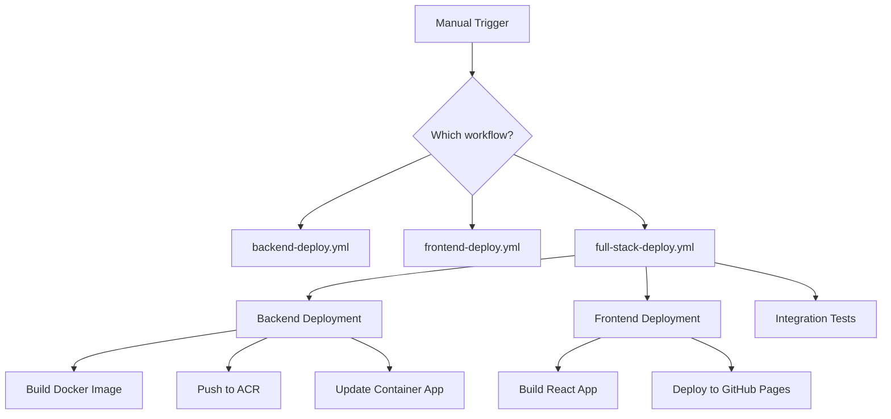

# GitHub Actions Workflow Configuration

This guide explains how to configure the GitHub Actions workflows for your own deployment of the Malta Business Indexer.

## 🔧 Configurable Parameters

The workflows support the following configurable parameters to avoid hardcoded values:

### Backend Deployment Parameters

| Parameter | Description | Default Value | Required |
|-----------|-------------|---------------|----------|
| `azure_resource_group` | Azure Resource Group name | `malta-indexer-rg` | No |
| `container_registry_name` | Azure Container Registry name | `maltaindexeracr` | No |
| `container_app_name` | Azure Container App name | `malta-indexer-backend` | No |
| `image_name` | Docker image name | `malta-business-indexer-backend` | No |

### Frontend Deployment Parameters

| Parameter | Description | Default Value | Required |
|-----------|-------------|---------------|----------|
| `backend_url` | Backend API URL | `https://malta-indexer-backend.azurecontainerapps.io` | No |
| `frontend_url` | Frontend URL for health checks | `https://yourusername.github.io/Malta-Business-Indexer` | No |

## 🚀 Deployment Options

### Option 1: Manual Deployment with Custom Parameters

All deployments are manual to ensure control and verification:

1. **Go to GitHub Actions tab** in your repository
2. **Select the workflow** you want to run:
   - `Deploy Backend to Azure Container Apps`
   - `Deploy Frontend to GitHub Pages`
   - `Full Stack Deployment`
3. **Click "Run workflow"**
4. **Fill in custom parameters** if different from defaults
5. **Click "Run workflow"** to start deployment

#### Example: Deploy to Your Own Azure Resources

```yaml
# Manual workflow dispatch parameters
azure_resource_group: "my-malta-indexer-rg"
container_registry_name: "mycompanyacr"
container_app_name: "my-malta-backend"
frontend_url: "https://myusername.github.io/Malta-Business-Indexer"
```

### Option 2: Customize Default Values

The workflows are configured for manual deployment only. To customize the default values:

1. **Fork the repository**
2. **Update the default values** in the workflow files
3. **Trigger manually** via GitHub Actions tab

#### Customize Default Values

Edit the workflow files to change defaults:

**`.github/workflows/backend-deploy.yml`:**
```yaml
workflow_dispatch:
  inputs:
    azure_resource_group:
      default: 'malta-indexer-rg'     # Change this
    container_registry_name:
      default: 'maltaindexeracr'      # Change this
    container_app_name:
      default: 'malta-backend-app'    # Change this
```

**`.github/workflows/frontend-deploy.yml`:**
```yaml
workflow_dispatch:
  inputs:
    backend_url:
      default: 'https://malta-backend-app.azurecontainerapps.io'  # Change this
    frontend_url:
      default: 'https://yourusername.github.io/Malta-Business-Indexer'  # Change this
```

## 🔐 Required Secrets

Set these secrets in your GitHub repository (`Settings > Secrets and variables > Actions`):

| Secret | Description | How to Get |
|--------|-------------|------------|
| `AZURE_CREDENTIALS` | Azure service principal JSON | [Azure CLI Guide](https://docs.microsoft.com/en-us/azure/developer/github/connect-from-azure) |
| `REGISTRY_USERNAME` | Container registry username | Azure Portal > Container Registry > Access keys |
| `REGISTRY_PASSWORD` | Container registry password | Azure Portal > Container Registry > Access keys |

### Creating Azure Service Principal

```bash
# Login to Azure
az login

# Create service principal
az ad sp create-for-rbac \
  --name "GitHub-Actions-Malta-Indexer" \
  --role contributor \
  --scopes /subscriptions/{subscription-id}/resourceGroups/{resource-group} \
  --sdk-auth

# Copy the JSON output and add it as AZURE_CREDENTIALS secret
```

## 🔄 Workflow Relationships



## 📝 Customization Examples

### Example 1: Deploy to Different Azure Subscription

```yaml
# Update these values in your fork
azure_resource_group: "malta-indexer-prod"
container_registry_name: "maltaindexerprod"
container_app_name: "malta-indexer-backend"
```

### Example 2: Use Custom Domain for Frontend

```yaml
# Update frontend URL for health checks
frontend_url: "https://malta-stores.example.com"
```

### Example 3: Different Image Name

```yaml
# Use organization-specific image naming
image_name: "myorg/malta-business-indexer"
```

## 🛠️ Troubleshooting

### Common Issues

1. **Workflow fails with authentication error**
   - Check `AZURE_CREDENTIALS` secret is correctly formatted JSON
   - Verify service principal has required permissions

2. **Container Registry access denied**
   - Verify `REGISTRY_USERNAME` and `REGISTRY_PASSWORD` are correct
   - Check if Container Registry admin user is enabled

3. **Resource not found errors**
   - Verify resource names match your Azure resources
   - Check resource group and subscription are correct

### Debug Mode

To enable debug logging, add this to your workflow:

```yaml
env:
  ACTIONS_STEP_DEBUG: true
  ACTIONS_RUNNER_DEBUG: true
```

## 🤝 Contributing Workflow Changes

If you improve the workflows:

1. Test changes in your fork first
2. Create a pull request with clear description
3. Include examples of the new functionality
4. Update this documentation if needed

## 📚 Additional Resources

- [GitHub Actions Documentation](https://docs.github.com/en/actions)
- [Azure Container Apps Documentation](https://docs.microsoft.com/en-us/azure/container-apps/)
- [GitHub Pages Documentation](https://docs.github.com/en/pages)
- [Azure Container Registry Documentation](https://docs.microsoft.com/en-us/azure/container-registry/)